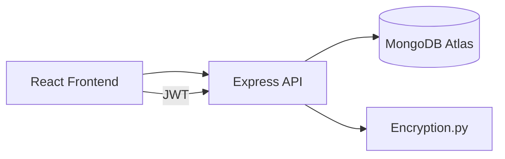

# EHRS (Encrypted Health Record System)

Secure, role-based healthcare record management built with a MERN stack and encrypted medical document workflows.

## 1) What This Project Solves

EHRS provides a centralized platform for patients, doctors, and administrators to access and manage medical records with controlled permissions.  
It focuses on data privacy, safe sharing, and traceable updates for healthcare workflows.

## 2) Core Goals

- Protect sensitive health data using encrypted storage flow.
- Enforce role-specific access for `Admin`, `Doctor`, and `Patient`.
- Provide dashboards for appointments and record management.
- Keep system operations auditable and maintainable.

## 3) System Snapshot



## 4) Main Features

- Role-based signup/login and dashboard redirection.
- Admin-driven doctor-patient appointment linking.
- Medical record creation, update, retrieval, and file viewing.
- Version history for doctor note updates.
- Patient PDF summary export of appointments and records.
- Search/filter/sort support in admin connection tables.
- Smart email appointment reminders (manual run + optional cron mode).

## 5) Tech Stack

### Frontend (`medical`)
- `React` + `Vite`
- `TailwindCSS`
- `react-router-dom`
- `axios`

### Backend (`backend`)
- `Node.js`, `Express`
- `MongoDB` + `Mongoose`
- `bcrypt`, `jsonwebtoken`
- `multer` for file uploads
- `pdfkit` for PDF summary export

## 6) API Contract (Key Endpoints)

### Auth
- `POST /login` -> returns user profile + JWT token
- `GET /api/auth/verify` -> validates bearer token

### Users / Roles
- `POST /api/users` -> create Admin/Doctor/Patient account

### Appointments
- `POST /admin/connect` -> create appointment
- `GET /admin/active-connections` -> admin table data
- `POST /admin/update-appointment-status` -> status update
- `POST /admin/reminders/run-now` -> send reminders for upcoming appointments

### Medical Records
- `POST /api/create-medical-record`
- `PUT /api/update-medical-record`
- `GET /api/medical-record/:recordId/versions` -> note history
- `GET /api/view-file/:fileId`

### Patient Utilities
- `GET /api/patient/:patientId/all-medical-records`
- `GET /api/patient/:patientId/export-summary` -> PDF download

## 7) Local Setup

Run backend first, then frontend.

### Backend
```bash
cd backend
npm install
npm run dev
```

### Frontend
```bash
cd medical
npm install
npm run dev
```

## 8) Environment Variables

Create `backend/.env` with:

```env
MongoURL=<your-mongodb-connection-string>
PORT=5000
JWT_SECRET=<your-jwt-secret>
SMTP_HOST=<smtp-host>
SMTP_PORT=<smtp-port>
SMTP_USER=<smtp-username>
SMTP_PASS=<smtp-password>
SMTP_FROM=<optional-from-email>
ENABLE_REMINDER_CRON=false
REMINDER_LOOKAHEAD_MINUTES=90
```

## 9) Notes and Constraints

- MongoDB Atlas network access must allow your machine IP.
- Uploaded files are stored under `backend/uploads`.
- Encryption helper script requires Python availability for encrypt/decrypt paths.
- Reminder emails require valid SMTP credentials and real recipient email addresses.

## 10) Performance Targets

- Auth response target: < 2s
- Dashboard data fetch target: < 2s
- Record operations target: near real-time for typical document sizes


